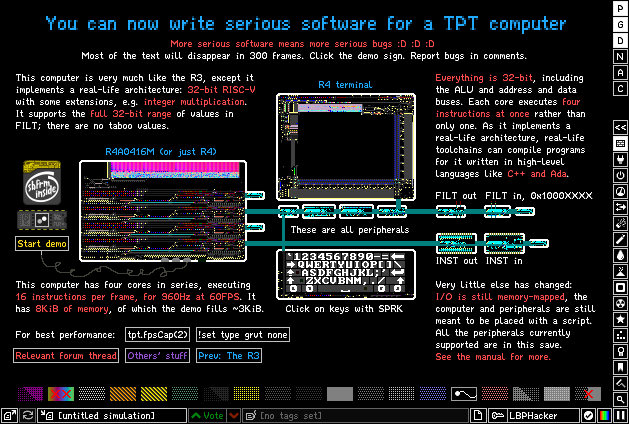

# R432 reference manual

*What's as big as half the simulation area, burns tens of thousands of your particle budget, puts out a load of EHOLE and particle ID allocation noise, and cuts BODY V5 into three pieces? A TPT computer made to cut BODY V5 into four pieces!*



Check out [the showcase save][004] in your browser. This is an R4A0416M, see [Numbering scheme](#numbering-scheme) below. Come and discuss it on the [Subframe Discord Server][001], an official branch of the [TPT Discord Server][002] that happened to be created earlier. Feel free to suggest improvements for this manual, the computers, or their peripherals.

> [!note]
> Ordinal numbers throughout this manual start at 0, yielding odd-looking constructs such as *0th* and *bit 0*, the least significant bit. For clarity's sake the English word *first* is never used to refer to ordinals.

> [!note]
> Instruction spellings and expansions reflect the state of integration with [TPTASM][003].

> [!tip]
> This manual is intended to be read or at least skimmed from top to bottom. **Please do that or at least use the "Find in page" or Ctrl+F feature of your browser before asking for help with topics that it already covers.** Terms in later parts are probably defined in earlier parts. If not, that is probably my mistake and I appreciate if you tell me.

# Buzzwords

 - **real-life architecture**: RISC-V, supports real-life compilers and programming languages
 - **data bus**: 32-bit, works with *every* 32-bit value, no questions asked
 - **address bus**: likewise 32-bit, yielding a 4GiB address space
 - **registers**: 32-bit words, 31 general purpose read-write, 1 read-only *zero*
 - **ALU**: 32-bit addition, shift, bitwise operations, 32-by-32-bit *multiplication* with 64-bit results
 - **interal memory**: byte-addressed, any amount of 32-bit words from 512B to 32KiB in increments of 512B
 - ***spatial unrolling***: (much) more than 1 instruction executed in a simulation frame
 - **input and output**: memory-mapped, control lines are exposed, *wait cycles* can be injected

## Real-life architecture: RISC-V

This family of computers uses an instruction set architecture that is arguably becoming mainstream, and indeed, many real-life tools exist that target RISC-V. This means that you can use well-established ahead-of-time-compiled native programming languages to program these computers, such as Rust, C++, C, or Ada.

The option to write programs in assembly the way more typical of my computers is also available through TPTASM support.

See [Writing and uploading programs](#writing-and-uploading-programs) for details.

## 32-bit data and address buses

All 32-bit values can be read and written by these computers. This is in stark contrast with less-than-32-bit computers typically seen in TPT, which need a keep-alive or sentinel bit somewhere, and with my R3 family of computers, which are quasi-32-bit, meaning that a few out of all 32-bit values are taboo and cannot be properly read or written.

Addresses are also 32-bit, which in theory allows for addressing 4GiB of memory, though of course no configuration of this computer supports that much internal memory, and there is little reason to need that much for memory-mapped peripherals. In practice, this is mainly a result of following the RISC-V specification, and also symmetry, i.e. it would feel weird if it was not 32-bit while everything else was.

## 32-bit registers

There are 31 general purpose read-write registers `x1` to `x31`, and also one read-only register `x0` that always reads `0x00000000`. This read-only register can be used as the destination operand to an operation, in which case the output produced by the operation is discarded. Again, this is just a RISC-V thing.

## ALU

The ALU operates on all 32 bits of registers and 12-bit immediate values, as is typical for RISC-V. It is capable of addition and subtraction, with or without carry and borrow, bitwise OR, AND, and XOR, and left shift, and logical and arithmetic right shift. Unlike all my precious computers, these operations do not output flags. Instead, comparisons are made with dedicated instructions and their results are stored in registers, again, as is typical for RISC-V.

The ALU is also capable of 32-by-32-bit unsigned and signed multiplication, which yields 64-bit numbers. Either or both halves of the result can be stored.

## Internal memory

The internal memory is arranged into a configurable number `memory_rows` of rows of 128 32-bit words. A 32KiB chunk of the 32-bit address space at the configurable base address `memory_base` is divided into 64 512B blocks, which are mapped to the internal memory as follows:

 - `memory_rows` blocks are mapped to the corresponding row in the internal memory in read-write mode, meaning that reads addressing them are by default served by the internal memory, and writes addressing them are by default handled by it;
 - `64 - memory_rows` blocks are mapped to the highest-address row of the internal memory in read-only mode, meaning that reads addressing them are by default served by the internal memory, but writes are ignored by it.

Consider the example of `memory_base` being `0x00458000` and `memory_rows` being `13`: in this case, the memory map is as follows:

| first byte | last byte | block number | reads served by | writes handled by |
|-|-|-|-|-|
| 0x00000000 | 0x00457FFF | | possibly peripherals | possibly peripherals |
| 0x00458000 | 0x004581FF | 0 | row 0 | row 0 |
| 0x00458200 | 0x004583FF | 1 | row 1 | row 1 |
| 0x00458400 | 0x004585FF | 2 | row 2 | row 2 |
| 0x00458600 | 0x004587FF | 3 | row 3 | row 3 |
| ... | ... | ... | ... | ... |
| 0x00459600 | 0x004597FF | 11 | row 11 | row 11 |
| 0x00459800 | 0x004599FF | 12 | row 12 | row 12 |
| 0x00459A00 | 0x00459BFF | 13 | row 12 | nothing |
| 0x00459C00 | 0x00459DFF | 14 | row 12 | nothing |
| 0x00459E00 | 0x00459FFF | 15 | row 12 | nothing |
| ... | ... | ... | ... | ... |
| 0x0045FC00 | 0x0045FDFF | 62 | row 12 | nothing |
| 0x0045FE00 | 0x0045FFFF | 63 | row 12 | nothing |
| 0x00460000 | 0xFFFFFFFF | | possibly peripherals | possibly peripherals |

## Spatial unrolling

A configurable amount of execution units (EUs) may be vertically stacked on top of one another. These act as a single computer sped up by a factor of however many EUs there are compared to a computer with only one EU, resulting in an instructions per frame figure larger than 1.

Further, a single EU can execute multiple instructions: each EU has four sub-execution units (sub-EUs). Three of these are restricted-purpose sub-EUs (REU) and one is a general-purpose sub-EU (GEU), vertically stacked in this order. The details of what "restricted" means in this context are explained in [Instruction scheduling](#instruction-scheduling) below, but the main idea is that GEUs can execute almost all instructions, while REUs can only execute instructions that do not involve anything complicated, such as accessing memory or branching. Computers spend most of their time executing the simple sort of instructions that REUs can handle, so trading some number of GEUs for a greater number of REUs makes sense.

An additional layer of complexity on top of this is that the GEU in each EU can be either multiply-incapable, which does not have the 32-by-32-bit multiplier, or multiply-capable, which does have it. Thus, the EU itself is also either multiply-incapable or multiply-capable. See [Instruction scheduling](#instruction-scheduling) for further details.

A computer built entirely of multiply-incapable EUs cannot execute multiplication instructions and just hangs when attempting to do so anyway. This essentially means that it does not implement **Zmmul**.

## Input and output

Input and output are implemented via memory mapping, i.e. treating read and write accesses to specific addresses as receiving data from and sending data to peripherals.

Each EU exposes its memory bus as lines of FILT, which can be used to, effectively, put peripherals "on the bus", letting it intercept reads and writes, or they can be left disconnected altogether, in which case they do not influence execution in any way.

In response to memory accesses addressed to it, peripherals may inject a wait cycle, which causes the sub-EU executing the access to functionally do nothing and let the next EU retry the access on its bus. This repeats until an EU finishes the access without a wait cycle being injected.

# Architecture

The architecture this family of computers implements largely follows the [RISC-V specification][000]. If you know what that means, see [Details for those with RISC-V background](#details-for-those-with-riscv-background) below. Otherwise, see [Details for those with no RISC-V background](#details-for-those-with-no-riscv-background) below.

## Details for those with RISC-V background

These computers implement the 32-bit base integer instruction set **RV32I**, with the extensions **Zicond**, **Zmmul**, and **Zifencei**. The memory system is little-endian.

Exceptions, interrupts, and traps do not exist. Thus, exceptions cannot be raised, interrupts cannot be serviced, and traps do not occur. `ecall` and `ebreak` are repurposed as "halt execution" instructions.

Many instructions reserved or declared illegal by the specification are perfectly valid and handled as *some* instruction by these computers. For example, as the optional 16-bit compressed instruction set is not supported, the lowest two bits of instructions are completely ignored and may take any configuration: behaviour in all cases is as if they take the configuration `11`.

The specification mandates an instruction-address alignment of 4 bytes for the base instruction set, but since exceptions do not exist, no instruction-address-misaligned exception is raised when a branch is made to an out-of-alignment address, though the 2 least significant bits of `pc` are cleared.

In general, if implementing the aforementioned instruction set exactly as specified would cause a hole to appear in the 32-bit instruction space, these computers handle instruction encodings in that hole the same way as one of the instruction encodings that are actually in the instruction set, and are "close", in terms of number of differing bits, to those in the hole. The primary reason for this is that it makes instruction decoding much simpler, and as exceptions do not exist, there would be no way to report a decoding failure anyway.

See [Instruction reference](#instruction-reference) for exact details, including some not covered by the specification.

## Details for those with no RISC-V background

RISC-V is an instruction set designed to be very simple to implement in its most basic form. There are barely any instructions other than those for memory access, ALU operations, and branching.

Instructions have one or two operand modes, only reading two registers or a register and an immediate value as inputs and writing one register for output. Memory access instructions support exactly one addressing mode that sums two operands to produce the address.

Mandatory ALU instructions are simple additive, shift, and bitwise instructions; everything else is optional. Ancillary ALU results, such as whether the addition caused an overflow or the result is 0, are not implicitly stored anywhere by ALU instructions and must instead be derived with instructions designed for this purpose, which output to registers.

Immediate values usually come from a 12-bit field in the instruction sign-extended to 32 bits, which covers the most frequently used immediate values. Anything outside the range available through that field is constructed with additional special instructions designed to provide the remaining 20 bits.

There are 32 general-purpose registers named `x0` to `x31`, one of which is the read-only `x0`, which always reads 0. This allows the instruction set to implement some special operations by using ordinary instructions with this register as one of their operands, e.g. negation is implemented as subtraction from `x0`.

There is also a 32-bit program counter named `pc`, which cannot be specified as an operand of any instruction. It can only be read by an instruction designed for `pc`-relative addressing, and can only be written by branch instructions.

See [Instruction reference](#instruction-reference) for details on the supported instructions.

## Instruction scheduling

The computer is either in the stopped or the running state. When the computer is running, it exercises all of its EUs, and together they behave like a single EU sped up by a factor of however many EUs there are physically.

The computer can only transition from the stopped to the running state by the start button (see below), in which case the topmost EU is the first to see the state change and act accordingly. Similarly, the halt and reset buttons deliver their requests such that the topmost EU is the first to be affected. Any EU can also transfer the computer from the running to the stopped state, in which case the EUs under it all see the state change and act accordingly.

EUs do nothing when the computer is in the stopped state. The rest of this section is concerned with the activities they perform when they see the computer in the running state. These activities are collectively called a *cycle*.

An EU first attempts to fetch four consecutive instructions; the first one from wherever `pc` points, then three more that follow the first one. Instruction fetches are served by internal memory and do not touch the bus. Further, for the purposes of fetching instructions, the 17 most significant bits of `pc` are ignored, and the 32KiB view of the internal memory is replicated over the 4GiB address space 131072 times.

This fetching of four instructions is always at least partially successful: the EU always succeeds in fetching at least one instruction, but it may fail in fetching all four. This happens when `pc` is near the end of a block of memory (see above): the instructions that would need to be fetched from the next block cannot be fetched by the EU in this cycle.

An EU then attempts to execute the instructions it fetched in the order they appear in the instruction stream. For each instruction it fetched, it attempts to execute the instruction on the next sub-EU that has not yet executed an instruction in this cycle. Recall that an EU consists of three REUs and one potentially multiply-capable GEU, in this order (see above).

If an REU is incapable of executing the instruction, it defers the instruction to the next sub-EU inside the EU, which may be another REU or the GEU. If the GEU is also incapable of executing the instruction, it defers the instruction to the next EU. Thus, an EU may execute anywhere from 0 to 4 instructions.

A sub-EU may be incapable of executing an instruction for multiple reasons. In some cases, this is a direct consequence of the nature of the instruction, i.e. given the encoding of the instruction, it is possible to decide whether a sub-EU is capable of executing it, see [Instruction reference](#instruction-reference) for details. In all other cases, this happens because a peripheral injects a wait cycle in response to an attempted memory access, see [Input and output](#input-and-output).

Ultimately, `pc` is increased by the number of instructions successfully executed times `4`, or changed to a completely new value if a branch is taken.

## Peripheral interface

These computers communicate with the outside world primarily through the memory buses of their EUs. Each EU has a memory bus, though it is conventional to connect peripherals to only one of these buses and leave the others unused. For this reason, and also for the sake of brevity, the buses of all EUs are collectively also referred to as the bus.

They also have some buttons and an indicator, which serve the much less critical purpose of turning the computer and and off and similar, and reporting its "is it on" state.

### The buttons and the indicator

The computer has three buttons on its bottom side, in this order from left to right:

 - reset: force execution to be halted, set the program counter to 0, cancel any injected wait cycles, transferring the computer from the running to the stopped state;
 - halt: request execution to be halted;
 - start: start execution, transferring the computer from the stopped to the running state.

It also has an indicator next to these buttons that lights up when the computer is running.

The difference between forcing and requesting execution to be halted is that forcing it brings the computer to an indeterminate state in terms of memory and register contents, though at least a state from which execution can be restarted normally nonetheless, while requesting it waits for all pending memory accesses to finish, and only then transfers the computer from the running to the stopped state.

> [!note]
> As wait cycles prevent memory accesses from finishing, halt requests are ignored if a wait cycle has been injected into the bottommost execution unit. This can keep happening indefinitely if the execution unit is trying to access an address in memory that is not backed by either the internal memory or any peripheral. In this case, the computer must be reset instead.

### The memory bus

> [!note]
> This section discusses details whose understanding is only necessary if you plan on building your own peripherals. Building peripherals is a daunting task, but contributions are welcome. If unsure or if you have an idea for a new peripheral but no idea how to build it, ask me to see if maybe I have a better suggestion or can build it for you.

The FILT lines of the memory bus are, from top to bottom, as follows:

#### Address 24 LSB output

Produces the 24 least significant bits of the address being accessed by the EU. Peripherals may decide to act based on this address.

Bit layout:

| 31..26 | 25 | 24 | 23..0 |
|-|-|-|-|
| `000100` | *Write Access* | *Read Access* | *Address 24 LSB* |

At most one of the *Write Access* and *Read Access* bits is ever set in any given frame.

The portion of the address available here is valid only if one of the *Write Access* and *Read Access* bits is set; it is indeterminate and should be ignored otherwise.

#### Address 8 MSB + Data 16 LSB output

Produces the 8 most significant bits of the address, and also the 16 least significant bits of the data being written.

Bit layout:

| 31..27 | 26 | 25 | 24 | 23..16 | 15..0 |
|-|-|-|-|-|-|
| `00010` | *Sign Extend* | *Word Access* | *Halfword Access* | *Address 8 MSB* | *Data 16 LSB* |

The portion of the data being written available here is valid only if the *Address 24 LSB* output indicates that the EU is executing a write; it is indeterminate and should be ignored otherwise.

The portion of the address available here and the *Sign Extend*, *Word Access*, and *Halfword Access* bits are valid only if the *Address 24 LSB* output indicates that the EU is executing a read or a write; they are indeterminate and should be ignored otherwise.

Any number of the *Word Access* and *Halfword Access* bits may be set in any given frame. If both the *Word Access* and *Halfword Access* bits are set, the *Halfword Access* bit should be ignored and the access treated as a word access.

Accesses are meant to have the same alignment as the size of the data they access, but the bus does not mask the least significant bits of addresses to enforce this. Thus, it is conventional for a peripheral to ignore the address bits that are not appropriate for an access it is handling. For example, if the *Halfword Access* bit is set, the peripheral is expected to ignore the least significant bit of the 32-bit address.

In any sub-word write access, the peripheral is expected to extract the relevant portion of bits from the 32 bits of data being written. For example, if the *Halfword Access* bit is set, and the second least significant bit of the 32-bit address is also set, the peripheral is expected to extract the 16 most significant bits of the 32 bits of data being written. Due to the added complexity of this requirement, it is conventional for a peripheral to only respond to word-sized write accesses.

In any sub-word read access, the peripheral is expected to provide 32 bits of data, with the relevant portion of bits filled with the data being read. For example, if the *Halfword Access* bit is set, and the second least significant bit of the 32-bit address is also set, the peripheral is expected to deposit the data being read in the 16 most significant bits of the 32 bits it provides. Due to the added complexity of this requirement, it is conventional for a peripheral to only respond to word-sized read accesses.

The *Sign Extend* bit is only informative and a peripheral should make no decision based on it. Crucially, a peripheral does not have to do anything even remotely similar to sign extension on the data it provides in response to a read access; the bus does the sign extension of the relevant portion of the data on its own.

#### Data 16 MSB output

Produces the 16 most significant bits of the data being written.

Bit layout:

| 31..16 | 15..0 |
|-|-|
| `0001000000000000` | *Data 16 MSB* |

The portion of the data being written available here is valid only if the *Address 24 LSB* output indicates that the EU is executing a write; it is indeterminate and should be ignored otherwise.

#### Bus State input

Takes the bus state, which peripherals use this to indicate that they want the EU to wait, for data to be available to be read for example, or that they want to handle an access, and also takes the 16 least significant bits of the data being read.

Bit layout:

| 31..18 | 17 | 16 | 15..0 |
|-|-|-|-|
| `00010000000000` | *Wait Request* | *Access Handled* | *Data 16 LSB* |

If left disconnected, it is internally reset such that it indicates no wait cycle request and no access handled.

A peripheral sets the *Access Handled* bit if it wants to mark a read or write access handled. This prevents the internal memory from handling the access, and if it is a read access, overrides the its results with the data provided by this input and the *Data 16 MSB* input. It is only valid to set this bit if the *Address 24 LSB* output indicates that the EU is executing a read or a write.

A peripheral sets the *Wait Request* bit if it wants to defer the read or write access to a later EU, or potentially any EU in a later simulation frame. This prevents the internal memory from handling the access, and causes the next EU to retry the access. It is only valid to set this bit if the *Address 24 LSB* output indicates that the EU is executing a read or a write.

#### Data 16 MSB input

Takes the 16 most significant bits of the data being read.

Bit layout:

| 31..16 | 15..0 |
|-|-|
| `0001000000000000` | *Data 16 MSB* |

### Conventional bus structure

To make the bus, as explained so far, convenient to use, the convention is to include a dummy peripheral at the end of the part of the bus exposed on each EU that injects a wait cycle whenever an access happens on the bus that is not handled by the internal memory. This does two things. First, it ensures that the internal memory responds only in the address range configured by the `memory_base` property, and second, combined with peripherals that override the bus state and data input generated by all other peripherals to their right, it ensures that all bus accesses that are not handled by a real peripheral or the internal memory result in a wait cycle being injected.

This makes the bus much more convenient to use, as this means that an instruction that is meant to access a specific peripheral can be safely executed on any EU, not only the one the peripheral is connected to. If it is executed on another EU, the dummy peripherals at the ends inject wait cycles until the instruction is attempted to be executed by the correct EU.

If there is no ambiguity in which peripheral handles which bus access, i.e. there is no kind of bus access that multiple peripherals present on the bus may handle, this approach ensures that bus accesses are always routed to the correct peripheral, without any consideration required on the software side.

# Writing and uploading programs

We tend to design our own instruction sets because our problems and goals are slightly different from those that real-life instruction sets solve and target. Modern instruction sets are designed for superscalar out-of-order execution, the sort of situation where a move operation ends up changing a pointer somewhere deep inside the register file, sometimes with zero latency, rather than actually move data around.

The average TPT computer is nowhere near this sophisticated: a simple move often takes the exact same "time", i.e. has the same latency *and* throughput, as multiplication, if the instruction set supports it. Thus, TPT architectures and their instruction sets tend to be at least somewhat optimized to the problems at hand, and this manifests as some level of eccentricity compared to modern mainstream instruction sets. This is beneficial for performance, but it also isolates these computers from the rest of the industry, including decades' worth of advancements in compiler technology.

So, to avoid this for a change, this family of computers targets RISC-V. Programs for them can be written directly in RISC-V assembly or less directly via real-life toolchains that compile high-level languages to RISC-V code.

## RISC-V assembly

Business as usual: grab [TPTASM][003]; see usage documentation there.

> [!note]
> TPTASM does not support the standard RISC-V assembler niceties like `li` for combined `lui` and `addi`. It only understands the mnemonics used throughout this manual.

## High-level languages

So I have bad news and good news.

The bad news are that in order to target a computer, including these computers, with a real-life toolchain, one must find a compatible toolchain, write a linker script to explain the memory map of the computer to the toolchain, and write a bunch of other scripts to actually get code to compile and to extract said code from whatever container format the toolchain outputs.

The good news is that [I have a working setup for you](./showcase). The showcase is in C++, but I am sure the infrastructure is possible to adapt to other high-level languages that the toolchain supports.

# Instruction reference

> [!note]
> This section discusses details whose understanding is only necessary for programming these computers with RISC-V assembly through TPTASM and for writing code that relies on timing and so needs to be aware of when and how each instruction is executed. If unsure, see [High-level languages](#high-level-languages) above to see if they satisfy your needs and might save you from having to learn details about RISC-V and these computers.

Behavioural details match those in the [RISC-V specification][000] exactly, but encoding details slightly differ: due to the relatively lax decoding rules these computers implement, many instructions have `X` bits in their encoding that can be either `0` or `1` without effect on the instruction's interpretation.

Groups of instructions in this section are listed in encoding order. For the purpose of encoding:

 - `X` and operand bits are treated as if they are `0`;
 - higher order bits are prioritized above lower order bits;
 - groups of instructions are ordered by their *representative*, which is the instruction with the encoding that compares lowest among all of those in the group.

This happens to yield a largely logical grouping of instructions, because RISC-V encoding is just that nice.

The register operands *RS1*, *RS2*, and *RD* always span 5 bits, allowing all 32 registers to be addressed.

Instruction mnemonics are difficult to sensibly derive from the wording of this manual. For detailed rationale, consult the [RISC-V specification][000] instead.

## Memory load

These instructions load a byte, halfword, or word from the address in the register *RS1* offset by the 12-bit signed immediate value *S12* sign-extended to 32 bits into the register *RD*. `lb` and `lbu` load a byte (8-bit value), `lh` and `lhu` load a halfword (16-bit value), and `lw` loads a word (32-bit value). `lbu` and `lhu` zero-extend the value to 32 bits that they load into *RD*, while `lb` and `lh` sign-extend it. `lw` loads a 32-bit value, so it does not do any kind of extension.

The memory access these instructions produce is meant to have the same alignment as the size of the data it accesses. The internal memory enforces this by ignoring the least significant bits of the address as appropriate. It is conventional for peripherals to do the same, but consult their manuals for details. Thus, the behaviour of unaligned accesses is unspecified in general and they should be avoided.

These instructions can only be executed by GEUs. A GEU fails to execute these instructions if and only if the peripheral that responds to the access injects a wait cycle.

Encoding:

| 31..20 | 19..15 | 14..12 | 11..7 | 6..0 | mnemonic | from |
|-|-|-|-|-|-|-|
| *S12* | *RS1* | `000` | *RD* | `000X0XX` | `lb RD, RS1, S12`  | **RV32I** |
| *S12* | *RS1* | `001` | *RD* | `000X0XX` | `lh RD, RS1, S12`  | **RV32I** |
| *S12* | *RS1* | `X1X` | *RD* | `000X0XX` | `lw RD, RS1, S12`  | **RV32I** |
| *S12* | *RS1* | `100` | *RD* | `000X0XX` | `lbu RD, RS1, S12` | **RV32I** |
| *S12* | *RS1* | `101` | *RD* | `000X0XX` | `lhu RD, RS1, S12` | **RV32I** |

## Memory fence

`fence` and `fence_i` might do something with caches and memory access queues on a real-life computer. On these computers, they are no-operations.

This is because there are absolutely no caches and memory access queues in these computers. Even memory stores and instruction fetches are guaranteed to not interfere, because only GEUs can execute memory stores, and their storing the value is the last thing that happens before the next EU fetches its instructions.

These instructions can only be executed by GEUs, which always succeed in executing them.

Encoding:

| 31..0 | mnemonic | from |
|-|-|-|
| `XXXXXXXXXXXXXXXXXXX0XXXXX000X1XX` | `fence` | **RV32I** |
| `XXXXXXXXXXXXXXXXXXX1XXXXX000X1XX` | `fence_i` | **Zifencei** |

## Additive operations

`addi` and `add` perform 2's complement addition with the value in the register *RS1* as the left hand side operand and with the 12-bit signed immediate value *S12* sign-extended to 32 bits or the value in the register *RS2* as the right hand side operand, then store the result in the register *RD*.

Overflow causes the result to wrap around modulo `0x100000000` and is otherwise ignored. Detect overflow by comparing an appropriate input operand with the result.

`sub` is the same but it does subtraction, with the operands ordered the same way. There is no separate instruction for subtraction of an immediate value because it can be implemented through addition of the 2's complement inverse immediate value.

These instructions can be executed by both REUs and GEUs, which always succeed in executing them.

Encoding:

| 31..20 | 19..15 | 14..12 | 11..7 | 6..0 | mnemonic | from |
|-|-|-|-|-|-|-|
| *S12* | *RS1* | `000` | *RD* | `001X0XX` | `addi RD, RS1, S12` | **RV32I** |

| 31..25 | 24..20 | 19..15 | 14..12 | 11..7 | 6..0 | mnemonic | from |
|-|-|-|-|-|-|-|-|
| `X0XXXX0` | *RS2* | *RS1* | `000` | *RD* | `011X0XX` | `add RD, RS1, RS2` | **RV32I** |
| `X1XXXX0` | *RS2* | *RS1* | `000` | *RD* | `011X0XX` | `sub RD, RS1, RS2` | **RV32I** |

## Shift operations

`slli` and `sll` shift the value in the register *RS1* to the left by the 5-bit value stored in the 5 least significant bits of *RS2*, or the 5-bit unsigned immediate value *AMT*. The bits shifted in on the right are all zeros. It is not possible to specify a shift amount larger than 31.

`srli` and `srl` are the same but they perform a logical shift to the right. The bits shifted in on the right are all zeros.

`srli` and `srl` are the same but they perform an arithmetic shift to the right. The bits shifted in on the right are copies of the most significant bit of *RS1*.

These instructions can be executed by both REUs and GEUs, which always succeed in executing them.

Encoding:

| 31..25 | 24..20 | 19..15 | 14..12 | 11..7 | 6..0 | mnemonic | from |
|-|-|-|-|-|-|-|-|
| `XXXXXXX` | *AMT* | *RS1* | `001` | *RD* | `001X0XX` | `slli RD, RS1, AMT` | **RV32I** |
| `X0XXXXX` | *AMT* | *RS1* | `101` | *RD* | `001X0XX` | `srli RD, RS1, AMT` | **RV32I** |
| `X1XXXXX` | *AMT* | *RS1* | `101` | *RD* | `001X0XX` | `srai RD, RS1, AMT` | **RV32I** |

| 31..25 | 24..20 | 19..15 | 14..12 | 11..7 | 6..0 | mnemonic | from |
|-|-|-|-|-|-|-|-|
| `XXXXXX0` | *RS2* | *RS1* | `001` | *RD* | `011X0XX` | `sll RD, RS1, RS2` | **RV32I** |
| `X0XXXX0` | *RS2* | *RS1* | `101` | *RD* | `011X0XX` | `srl RD, RS1, RS2` | **RV32I** |
| `X1XXXX0` | *RS2* | *RS1* | `101` | *RD* | `011X0XX` | `sra RD, RS1, RS2` | **RV32I** |

## Comparison operations

`slti` and `slt` set *RD* to `1` if the value in the register *RS1* compares lower than the 12-bit signed immediate value *S12* sign-extended to 32 bits or the value in the register *RS2*, or `0` otherwise. They use 2's complement signed arithmetic for the comparison.

`sltiu` and `sltu` are the same but they use 2's complement unsigned arithmetic.

These instructions can be executed by both REUs and GEUs, which always succeed in executing them.

Encoding:

| 31..20 | 19..15 | 14..12 | 11..7 | 6..0 | mnemonic | from |
|-|-|-|-|-|-|-|
| *S12* | *RS1* | `010` | *RD* | `001X0XX` | `slti RD, RS1, S12`  | **RV32I** |
| *S12* | *RS1* | `011` | *RD* | `001X0XX` | `sltiu RD, RS1, S12` | **RV32I** |

| 31..25 | 24..20 | 19..15 | 14..12 | 11..7 | 6..0 | mnemonic | from |
|-|-|-|-|-|-|-|-|
| `XXXXXX0` | *RS2* | *RS1* | `010` | *RD* | `011X0XX` | `slt RD, RS1, RS2`  | **RV32I** |
| `XXXXXX0` | *RS2* | *RS1* | `011` | *RD* | `011X0XX` | `sltu RD, RS1, RS2` | **RV32I** |

## Bitwise operations

`xori` and `xor` take the bitwise XOR of the value in the register *RS1* and the 12-bit signed immediate value *S12* sign-extended to 32 bits or the value in the register *RS2*.

`ori` and `or` are the same but they take the bitwise OR.

`andi` and `and` are the same but they take the bitwise AND.

These instructions can be executed by both REUs and GEUs, which always succeed in executing them.

Encoding:

| 31..20 | 19..15 | 14..12 | 11..7 | 6..0 | mnemonic | from |
|-|-|-|-|-|-|-|
| *S12* | *RS1* | `100` | *RD* | `001X0XX` | `xori RD, RS1, S12` | **RV32I** |
| *S12* | *RS1* | `110` | *RD* | `001X0XX` | `ori RD, RS1, S12`  | **RV32I** |
| *S12* | *RS1* | `111` | *RD* | `001X0XX` | `andi RD, RS1, S12` | **RV32I** |

| 31..25 | 24..20 | 19..15 | 14..12 | 11..7 | 6..0 | mnemonic | from |
|-|-|-|-|-|-|-|-|
| `XXXXXX0` | *RS2* | *RS1* | `100` | *RD* | `011X0XX` | `xor RD, RS1, RS2` | **RV32I** |
| `XXXXXX0` | *RS2* | *RS1* | `110` | *RD* | `011X0XX` | `or RD, RS1, RS2`  | **RV32I** |
| `XXXXXX0` | *RS2* | *RS1* | `111` | *RD* | `011X0XX` | `and RD, RS1, RS2` | **RV32I** |

## Load upper immediate

`lui` moves the 20-bit unsigned value *U20* to the 20 most significant bits of register *RD*, setting the rest of them to 0.

`auipc` is the same but it also offsets the resulting value in *RD* with the value of `pc`, which is the same as the address of the `auipc` instruction.

These instructions can be executed by both REUs and GEUs, which always succeed in executing them.

Encoding:

| 31..12 | 11..7 | 6..0 | mnemonic | from |
|-|-|-|-|-|
| *U20* | *RD* | `001X1XX` | `auipc RD, U20` | **RV32I** |
| *U20* | *RD* | `011X1XX` | `lui RD, U20`   | **RV32I** |

## Memory store

These instructions store a byte, halfword, or word from the register *RS2* to the address in the register *RS1* offset by the 12-bit signed immediate value *S12* sign-extended to 32 bits.

`sb` stores the 8 least significant bits of the value in the register *RS2*.

`sh` stores the 16 least significant bits of the value in the register *RS2*.

`sw` stores all 32 bits of the value in the register *RS2*.

The memory access these instructions produce is meant to have the same alignment as the size of the data it accesses. The internal memory enforces this by ignoring the least significant bits of the address as appropriate. It is conventional for peripherals to do the same, but consult their manuals for details. Thus, the behaviour of unaligned accesses is unspecified in general and they should be avoided.

These instructions can only be executed by GEUs. A GEU fails to execute these instructions if and only if the peripheral that responds to the access injects a wait cycle.

Encoding:

| 31..25 | 24..20 | 19..15 | 14..12 | 11..7 | 6..0 | mnemonic | from |
|-|-|-|-|-|-|-|-|
| *S12[11..5]* | *RS2* | *RS1* | `X00` | *S12[4..0]* | `010XXXX` | `sb RS2, RS1, S12`  | **RV32I** |
| *S12[11..5]* | *RS2* | *RS1* | `X01` | *S12[4..0]* | `010XXXX` | `sh RS2, RS1, S12`  | **RV32I** |
| *S12[11..5]* | *RS2* | *RS1* | `X1X` | *S12[4..0]* | `010XXXX` | `sw RS2, RS1, S12`  | **RV32I** |

## Multiplication operations

`mulh` performs 2's complement multiplication of the signed values in the registers *RS1* and *RS2*, and stores the 32 most significant bits of the 64-bit result in the register *RD*.

`mulhu` is the same but it interprets the values in the registers *RS1* and *RS2* as unsigned.

`mulhsu` is the same but it interprets the values in the registers *RS1* as signed and *RS2* as unsigned.

`mul` is the same but it stores the 32 least significant bits of the result. There are no variants of `mul` for different combinations of signedness because the least significant 32 bits of the result are identical regardless of signedness.

`mulh`, `mulhsu`, and `mulhu` can only be executed by multiply-capable GEUs, which always succeed in executing them. `mul` can be executed by multiply-capable GEUs, which always succeed in executing it. `mul` can further be executed by multiply-incapable GEUs if and only if:

 - the GEU of the preceding EU is a multiply-capable GEU;
 - this preceding GEU executed a `mulh`, `mulhsu`, `mulhu`, or a `mul`;
 - the *RS1* operand of this previously executed instruction is the exact same as of the current one;
 - the *RS2* operand of this previously executed instruction is the exact same as of the current one;
 - the *RD* operand of this previously executed instruction is **not** the exact same as either the *RS1* or the *RS2* operand of the current one...

... or, more concisely, if the preceding GEU is multiply-capable and executed a multiplication operation with the exact same inputs as the current instruction, and did not overwrite any of those inputs in the meantime.

Encoding:

| 31..25 | 24..20 | 19..15 | 14..12 | 11..7 | 6..0 | mnemonic | from |
|-|-|-|-|-|-|-|-|
| `XXXXX01` | *RS2* | *RS1* | `X00` | *RD* | `011X0XX` | `mul RD, RS1, RS2`    | **Zmmul** |
| `XXXXX01` | *RS2* | *RS1* | `X01` | *RD* | `011X0XX` | `mulh RD, RS1, RS2`   | **Zmmul** |
| `XXXXX01` | *RS2* | *RS1* | `X10` | *RD* | `011X0XX` | `mulhsu RD, RS1, RS2` | **Zmmul** |
| `XXXXX01` | *RS2* | *RS1* | `X11` | *RD* | `011X0XX` | `mulhu RD, RS1, RS2`  | **Zmmul** |

## Conditionally move zero

`czero_eqz` moves the 32-bit zero value to the register *RD* if the value in the register *RS2* is equal to zero, or the value in the register *RS1* otherwise.

`czero_nez` is the same but it inverts the condition, checking whether the value in the register *RS2* is not equal to zero.

These instructions can be executed by both REUs and GEUs, which always succeed in executing them.

Encoding:

| 31..25 | 24..20 | 19..15 | 14..12 | 11..7 | 6..0 | mnemonic | from |
|-|-|-|-|-|-|-|-|
| `XXXXX11` | *RS2* | *RS1* | `X0X` | *RD* | `011X0XX` | `czero_eqz RD, RS1, RS2` | **Zicond** |
| `XXXXX11` | *RS2* | *RS1* | `X1X` | *RD* | `011X0XX` | `czero_nez RD, RS1, RS2` | **Zicond** |

## Conditional branch

These instructions conditionally change `pc` to the address in the register *RS1* offset by the 13-bit signed immediate value *S13* sign-extended to 32 bits, with the 2 least significant bits of the result cleared. The instructions only encode bits 12 to 1 of *S13*; the remaining bit is set to `0`.

In the case of `beq`, the condition is that *RS1* be equal to *RS2*.

In the case of `blt`, the condition is that *RS1* be less than *RS2*, using 2's complement signed arithmetic for the comparison.

In the case of `bltu`, the condition is that *RS1* be less than *RS2*, using 2's complement unsigned arithmetic for the comparison.

`bne`, `bge`, and `bgeu` are the same as `beq`, `blt`, and `bltu` respectively, but they invert the condition.

This instruction can be executed by GEUs, which always succeed in executing it. It can further be executed by REUs if and only if the branch is not taken.

> [!note]
> The [RISC-V specification][000] mandates only that the least significant bit of the new `pc` be cleared. The decision to clear two instead was made because it made some internal details simpler and because it would not affect valid code targeting these computers.

Encoding:

| 31 | 30..25 | 24..20 | 19..15 | 14..12 | 11..8 | 7 | 6..0 | mnemonic | from |
|-|-|-|-|-|-|-|-|-|-|
| *S13[12]* | *S13[10..5]* | *RS2* | *RS1* | `0X0` | *S13[4..1]* | *S13[11]* | `1X000XX` | `beq RS1, RS2, S13`  | **RV32I** |
| *S13[12]* | *S13[10..5]* | *RS2* | *RS1* | `0X1` | *S13[4..1]* | *S13[11]* | `1X000XX` | `bne RS1, RS2, S13`  | **RV32I** |
| *S13[12]* | *S13[10..5]* | *RS2* | *RS1* | `100` | *S13[4..1]* | *S13[11]* | `1X000XX` | `blt RS1, RS2, S13`  | **RV32I** |
| *S13[12]* | *S13[10..5]* | *RS2* | *RS1* | `101` | *S13[4..1]* | *S13[11]* | `1X000XX` | `bge RS1, RS2, S13`  | **RV32I** |
| *S13[12]* | *S13[10..5]* | *RS2* | *RS1* | `110` | *S13[4..1]* | *S13[11]* | `1X000XX` | `bltu RS1, RS2, S13` | **RV32I** |
| *S13[12]* | *S13[10..5]* | *RS2* | *RS1* | `111` | *S13[4..1]* | *S13[11]* | `1X000XX` | `bgeu RS1, RS2, S13` | **RV32I** |

## Jump and link register

`jalr` changes `pc` to the address in the register *RS1* offset by the 12-bit signed immediate value *S12* sign-extended to 32 bits, with the 2 least significant bits of the result cleared. It also writes the old value of `pc`, which is the same as the address of the `jalr` instruction, offset by 4 to the register *RD*.

This instruction can only be executed by GEUs, which always succeed in executing it.

> [!note]
> The [RISC-V specification][000] does not mandate that any least significant bit of the new `pc` be cleared. The decision to clear two instead was made because it made some internal details simpler and because it would not affect valid code targeting these computers.

Encoding:

| 31..20 | 19..15 | 14..12 | 11..7 | 6..0 | mnemonic | from |
|-|-|-|-|-|-|-|
| *S12* | *RS1* | `XXX` | *RD* | `1X001XX` | `jalr RD, RS1, S12` | **RV32I** |

## Jump and link

`jal` changes `pc` to the 21-bit signed value *S21* with the old value of `pc`, which is the same as the address of the `jal` instruction. It also writes the old value of `pc` offset by 4 to the register *RD*. The instruction only encodes bits 20 to 1 of *S21*; the rest are set to `0`.

This instruction can only be executed by GEUs, which always succeed in executing it.

Encoding:

| 31 | 30..21 | 20 | 19..12 | 11..7 | 6..0 | mnemonic | from |
|-|-|-|-|-|-|-|-|
| *S21[20]* | *S21[10..1]* | *S21[11]* | *S21[19..12]* | *RD* | `1X01XXX` | `jal RD, S21` | **RV32I** |

## Halt

`ecall` and `ebreak` transfer the computer from the running to the stopped state, acting as a "halt" instruction traditionally would.

These instructions can only be executed by GEUs, which always succeed in executing them.

Encoding:

| 31..0 | mnemonic | from |
|-|-|-|
| `XXXXXXXXXXX0XXXXXXXXXXXXX1X1XXXX` | `ecall`  | **RV32I** |
| `XXXXXXXXXXX1XXXXXXXXXXXXX1X1XXXX` | `ebreak` | **RV32I** |

# Example saves

## Example #1

[Small computer with small terminal](https://powdertoy.co.uk/Browse/View.html?ID=3394860)

 - machine ID: 1000
 - memory rows: 16
 - EUs: MI
 - memory base: `0x400000`
 - initial `pc`: `0x400000`
 - terminal base: `0x40E02000`

## Example #2

[Big computer with big terminal](https://powdertoy.co.uk/Browse/View.html?ID=3394861)

 - machine ID: 1000
 - memory rows: 64
 - EUs: MIMII
 - memory base: `0x400000`
 - initial `pc`: `0x400000`
 - terminal base: `0x40E02000`

## Example #3

[Tiny computer with INST I/O](https://powdertoy.co.uk/Browse/View.html?ID=3394862)

 - machine ID: 1000
 - memory rows: 4
 - EUs: M
 - memory base: `0x400000`
 - initial `pc`: `0x400000`
 - INST input base: `0xE0040000`
 - INST input width: 16
 - INST output base: `0xE0050000`
 - INST output width: 16

# Peripherals and configuration

> [!note]
> This section discusses details whose understanding is only necessary for building your own save with a custom set or layout of peripherals. If unsure, check [Example saves](#example-saves) above to see if there are any that fit your needs and might save you from having to build your own.

There exists no single version of the computer and its peripherals; instead, there exists a family of all of them, with distinct *configurations*. The configuration of such a component is the set of properties that determine its capabilities, in-game appearance, location in the simulation, and so on. The configuration options of each component are documented.

The showcase save is just one such configuration. Any configuration can be turned into a simulation using *r4plot.lua*.

Using this script requires some Lua knowledge, but only to the point of familiarity with table syntax. Grab *r4plot.lua* from [the releases page](https://github.com/LBPHacker/R432/releases). Beware, it is huge in Lua script terms. The script is expected to be run as a Lua function and given a single table as its first parameter: the configuration.

## Example script invocation

```lua
loadfile("/path/to/r4plot.lua")({
	components = {
		{
			type        = "cpu",
			name        = "cpu0",
			cores       = "mmi",
			memory_rows = 16,
			left        = 13,
			top         = 36,
			machine_id  = 1000,
			memory_base = 0x400000,
			start_pc    = 0x400000,
			auto_start  = true,
		},
		{
			type          = "terminal",
			name          = "terminal0",
			left          = 210,
			screen_bottom = 91,
			keyboard_top  = 115,
			chars_nh      = 12,
			chars_nv      = 8,
			single_pixel  = true,
			base_address  = 0x40E02000,
			bus = {
				cpu       = "cpu0",
				bus_index = 2,
			},
		},
	},
})
```

## Top-level configuration structure

Table, required. This is the first and only parameter to *r4plot.lua*.

### `.components` property

Table, required. This is an array of component configuration nodes.

### `.components[...].type` property

String, required. Refers to a component type. Each component has an associated `.type` documented alongside its configuration options.

### `.components[...].name` property

String, required, must be unique across all component configuration nodes. Can be any string. It is used to create connections between multiple components.

### `.x` and `.y` properties

Integers, optional, default to `0`. These enable offsetting the position in the simulation of everything by some amount. Helps with cosmetics.

### `.debug_stacks` property

Table, optional. If present, once the script is done plotting, it enters visual debug mode, with call stacks that resulted in the placement of each particle made visible when hovered. Stacks with multiple particles show multiple call stacks. This mode can be exited by running `r4plot.unregister()` in the console.

### `.debug_areas` property

Boolean, optional, defaults to `false`. If `true`, once the script is done plotting, it enters visual debug mode, with areas made visible. Areas cover parts of the plotted structures, and hovering over them displays their names. This mode can be exited by running `r4plot.unregister()` in the console.

### `.clear_sim` property

Boolean, optional, defaults to `false`. If `true`, the script erases the simulation and changes some simulation options to get the best possible performance. The computer and its peripherals are generally not sensitive to these settings, the intent is simply best performance.

## Computer

The computer exposes exactly as many buses as many execution units it has. These buses can be referred to with tables with two properties: `cpu` and `bus_index`. `cpu` is the `.name` of the computer instance, while `.bus_index` is an integer in the inclusive range `0` to `n - 1`, where `n` is the amount of execution units the computer has.

### Configuration

This component is available under the type `"cpu"`.

#### `.left` or `.right` properties

Integers, exactly one of the two required. This determines the horizontal placement of the given border (left or right) of the computer.

#### `.top` or `.bottom` properties

Integers, exactly one of the two required. This determines the vertical placement of the given border (top or bottom) of the computer.

#### `.machine_id` property

Integer, optional, defaults to `1337`. The identifier to encode in the TPTASM anchor.

#### `.cores` property

String, required. Each character is one of `"m"` and `"i"`, referring to multiply-capable and multiply-incapable EUs, respectively. The first character determines the type of the topmost execution unit, the second character of the second one, and so on. Must be at least a single character.

#### `.memory_rows` property

Integer, required, in the inclusive range 1 to 64. Specifies the amount of 512B blocks the internal memory spans.

#### `.memory` property

String or table, optional.

If a string, it is interpreted as a file path to a memory image containing a whole number of 32-bit words to be written to the computer's internal memory, starting from the lowest address of the 32KiB view of the internal memory. The 32-bit words in the file are to be encoded in little endian, with 4 bytes each.

If a table, it is interpreted as a 0-indexed array of 32-bit unsigned integers to be written to the computer's internal memory, starting from the lowest address of the 32KiB view of the internal memory.

If not specified, it is interpreted as an empty image specifying no 32-bit words.

The initial contents parts of memory not covered by these memory images are unspecified.

#### `.start_pc` property

32-bit unsigned integer, optional, must be a multiple of `4`, defaults to `0`. Specifies the initial value of `pc`.

#### `.auto_start` property

Boolean, optional, defaults to `false`. If `true`, the computer is plotted in a state that causes it to fully start up in a few frames.

#### `.memory_base` property

32-bit unsigned integer, optional, must be a multiple of `0x8000`, defaults to `0`. Specifies the base address of the 32KiB view of the internal memory.

#### Example configuration

```lua
{
	type        = "cpu",
	name        = "cpu0",
	cores       = "mmi",
	memory_rows = 16,
	left        = 13,
	top         = 36,
	machine_id  = 1000,
	memory_base = 0x400000,
	start_pc    = 0x400000,
	auto_start  = true,
}, -- mind the trailing comma
```

#### Numbering scheme

Since its publication, *r4plot.lua* has not changed significantly, thus, it implements revision "A" of the CPU. The numbering scheme is thus as follows: `R4A` followed by two 2-digit numbers, padded with zeros as required: the number of execution units and of memory rows, optionally followed by `M` if the computer has any multiply-capable EUs. The showcase save CPU has 4 execution units and 16 rows of memory and supports multiplication, hence R4A0416M.

This scheme does not reflect the amount and order of M and I execution units. This is mainly because the real purpose of the model number is to let TPTASM know how to access memory contents, and the number contains no more information than necessary for this purpose.

## Terminal

The display area is a collection of 8×8-pixel blocks, arranged into a configurable number of rows and columns, inside which pixels take any of 16 configurable colours.

The supported primitive operations are simple pixel plotting, the *scrollprint*, and printing a 8-by-8 bitmap.

Pixel plotting enables changing any pixel on the display.

A scrollprint involves scrolling every block in an arbitrary rectangular sub-area of the display blocks by exactly one block in any of the four main directions, and then filling the space thus freed up with copies of an arbitrary bitmap of a set of 256 8-by-8 bitmaps specified through configuration, but also editable through register accesses. Scrollprints can be requested directly or through terminal mode. Terminal mode introduces a cursor which respects the boundaries of the selected scrollprint sub-area, and can be configured to take different actions when printing characters and when reaching these boundaries.

Printing a 8-by-8 bitmap is done in two steps: the top 4 rows of the bitmap are sent along with colour data, then its bottom 4 rows sent along with position data.

### I/O range

The terminal's I/O range is accessible at a `0x2000`-byte-aligned `0x2000`-byte block in the address space. This is an array of `0x800` 32-bit words, into which bits 12 to 2 of the addresses of accesses that concern this block form a sub-address, used to select read-only and write-only registers and write-triggered sub-ranges.

| first word | last word | register or sub-range | access |
|-|-|-|-|
| `0x0000` | `0x0000` | `input`       | read-only  |
| `0x0004` | `0x0004` | `hrange`      | write-only |
| `0x0008` | `0x0008` | `vrange`      | write-only |
| `0x000C` | `0x000C` | `cursor`      | write-only |
| `0x0010` | `0x0010` | `nlchar`      | write-only |
| `0x0014` | `0x0014` | `colour`      | write-only |
| `0x0018` | `0x0018` | `scrollmask`  | write-only |
| `0x001C` | `0x001C` | `plotpix`     | write-only |
| `0x0200` | `0x03FC` | `scrollprint` | write-only |
| `0x0400` | `0x07FC` | `beginbitmap` | write-only |
| `0x0800` | `0x0FFC` | `charmem`     | write-only |
| `0x1000` | `0x1FFC` | `endbitmap`   | write-only |

The effects of accessing any other address in the block are undefined. The effects of accessing any aforementioned register in a manner not appropriate for its capabilities are undefined.

See [Terminal.hpp](examples/Hardware/Terminal.hpp).

#### `input` register: keyboard input

This read-only register returns the 8-bit code associated with the most recently pressed key, and causes the terminal to forget about this key press. If the value 0 is read from this register, no key has been pressed since the last time this register was read.

Bit layout:

| 31..8 | 7..0 |
|-|-|
| `XXXXXXXXXXXXXXXXXXXXXXXX` | *Key* |

#### `colour` register: colours used for scrollprints

This write-only register holds the 4-bit colour indices used for printing characters.

Bit layout:

| 31..8 | 7..4 | 3..0 |
|-|-|-|
| `XXXXXXXXXXXXXXXXXXXXXXXX` | *Background Colour* | *Foreground Colour* |

The 16 hard-coded colours are as follows:

| index | rgb888 | name |
|-|-|-|
|  0 | `#000000` | black |
|  1 | `#0000AA` | dark blue |
|  2 | `#00AA00` | dark green |
|  3 | `#00AAAA` | dark cyan |
|  4 | `#AA0000` | dark red |
|  5 | `#AA00AA` | dark magenta |
|  6 | `#AAAA00` | dark yellow |
|  7 | `#AAAAAA` | light grey |
|  8 | `#555555` | dark grey |
|  9 | `#5555FF` | light blue |
| 10 | `#55FF55` | light green |
| 11 | `#55FFFF` | light cyan |
| 12 | `#FF5555` | light red |
| 13 | `#FF55FF` | light magenta |
| 14 | `#FFFF55` | light yellow |
| 15 | `#FFFFFF` | white |

#### `hrange` register: horizontal range used for scrollprints

This write-only register holds the horizontal range, or the column-wise extent of the scrollprint sub-area, in two 5-bit column indices. The range of meaningful values depends on configuration.

Bit layout:

| 31..10 | 9..5 | 4..0 |
|-|-|-|
| `XXXXXXXXXXXXXXXXXXXXXX` | *High Column* | *Low Column* |

Note that it is perfectly valid for *High Column* to hold a value lower than *Low Column*: in this case, when the horizontal dimension is the secondary dimension during a scrollprint, blocks are scrolled to the left, rather than to the right. When the two values are equal, scrolling is not visible.

#### `vrange` register: vertical range used for scrollprints

This write-only register holds the vertical range, or the row-wise extent of the scrollprint sub-area, in two 5-bit row indices. The range of meaningful values depends on configuration.

Bit layout:

| 31..10 | 9..5 | 4..0 |
|-|-|-|
| `XXXXXXXXXXXXXXXXXXXXXX` | *High Row* | *Low Row* |

Note that it is perfectly valid for *High Row* to hold a value lower than *Low Row*: in this case, when the vertical dimension is the secondary dimension during a scrollprint, blocks are scrolled upward, rather than downward. When the two values are equal, scrolling is not visible.

#### `cursor` register: cursor position used for scrollprints

This write-only register holds the position of the terminal mode cursor, in 5-bit row and column indices.

Bit layout:

| 31..10 | 9..5 | 4..0 |
|-|-|-|
| `XXXXXXXXXXXXXXXXXXXXXX` | *Row* | *Column* |

#### `nlchar` register: newline trigger character used for scrollprints

This write-only register holds the 8-bit character index used to signal that the terminal mode cursor should be moved to a new line.

Bit layout:

| 31..8 | 7..0 |
|-|-|
| `XXXXXXXXXXXXXXXXXXXXXXXX` | *Character* |

#### `scrollmask` register: scroll mask used for scrollprints

This write-only register holds the scroll mask used for printing characters.

Bit layout:

| 31 | 30 | ... | 0 |
|-|-|-|-|
| *Enable Column/Row 31* | *Enable Column/Row 30* | ... | *Enable Column/Row 0* |

Setting or clearing bits that correspond to columns or rows that do not exist has no effect.

#### `plotpix` register: plot pixel

This sub-range is meaningful only if the pixel plotter has been requested in the configuration.

Writing to this sub-range causes a pixel to be plotted, at the intersection of the row and column specified with 5-bit row and column indices, using a colour specified with a 4-bit colour index.

Bit layout:

| 31..20 | 19..16 | 15..8 | 7..0 |
|-|-|-|-|
| `XXXXXXXXXXXX` | *Colour* | *Row* | *Column* |

Note that the resolution of *Column* and *Row* is eightfold compared to the column and row indices of the scrollprint range and cursor registers.

#### `scrollprint` sub-range: scroll selection and print character

Writing to this sub-range causes a character to be printed. The bitmap used to print the character is loaded from the character ROM, from the index specified by the character index.

If row-oriented printing is enabled, the primary dimension of the scrollprint is the horizontal dimension, while the secondary dimension is the vertical dimension. If it is disabled, these roles are reversed. Scrolling happens along the secondary dimension, in the direction specified by the `hrange` and `vrange` registers.

If terminal mode is enabled, printing a character this way causes the character to be printed under the terminal mode cursor, and advances the cursor by 1 block along the primary dimension. If this causes the cursor to exit the selected sub-area, then at the next terminal mode scrollprint, before a character is printed, it is moved to the low position of the primary range and is advanced by 1 block along the secondary dimension. If this once again causes the cursor to exit the selected sub-area, then what happens next depends on whether terminal scrolling is enabled.

If terminal scrolling is enabled, the sub-area is automatically scrolled along the secondary dimension by one block, with the space thus feed up filled with the bitmap at the character index stored in the `nlchar` register. The cursor does not move along the secondary dimension, though it will have moved relative to the display's contents. If it is disabled, the cursor is simply moved to the low position of the secondary range.

Note that this automatic scroll can cause the terminal to take two frames to print a single character (one to execute the automatic scroll, and one to print the character). The automatic scroll is executed in the frame in which the terminal received the request, while the character is printed in the next frame. If a command is sent to the terminal in this frame, the terminal temporarily rejects the command by responding on the bus with a wait cycle.

If the newline trigger character is enabled, and the character index matches that stored in the `nlchar` register, everything happens as if the cursor has exited the selected sub-area while being advanced along the primary dimension, except no character is printed.

If terminal mode is disabled, printing a character this way causes a scroll in the selected sub-area, and the space thus feed up is filled with the bitmap at the specified character index.

If the scroll mask is enabled, the set of rows of columns subject to scrolling is determined by the `scrollmask` register for the duration of this scrollprint, rather than from the range of the scrollprint along the primary dimension, as specified by the `hrange` and `vrange` registers. This feature does not combine well with terminal mode.

Address bit layout:

| 31..13 | 12..9 | 8 | 7 | 6 | 5 | 4 | 3 | 2 | 1..0 |
|-|-|-|-|-|-|-|-|-|-|
| *Base Address* | `0001` | *Position Valid* | *Newline Trigger* | *Terminal Scrolling* | *Scrollmask* | *Row-Oriented* | *Colour Valid* | *Terminal Mode* | `00` |

Data bit layout:

| 31..26 | 25..20 | 19..16 | 15..12 | 11..8 | 7..0 |
|-|-|-|-|-|-|
| `XXXXXX` | *Row* | *Column* | *Background Colour* | *Foreground Colour* | *Character* |

*Background Colour* and *Foreground Colour* are only consulted if this is enabled with *Colour Valid*; otherwise, colours are taken from the `colour` register.

*Row* and *Column* are only consulted if this is enabled with *Position Valid*; otherwise, colours are taken from the `cursor` register.

#### `beginbitmap` sub-range: first step of printing a 8-by-8 bitmap

Writing to this sub-range executes the first step of printing a 8-by-8 bitmap is done in two steps: it sends the top 4 rows of the bitmap along with colour data.

| 31..13 | 12..10 | 9..6 | 5..2 | 1..0 |
|-|-|-|-|-|
| *Base Address* | `001` | *Background Colour* | *Foreground Colour* | `00` |

Data bit layout:

| 31 | 30 | ... | 23 | ... | 0 |
|-|-|-|-|-|-|
| *Row 3, Column 7* | *Row 3, Column 6* | ... | *Row 2, Column 7* | ... | *Row 0, Column 0* |

A set bit in the bitmap causes the corresponding pixel to be drawn with the foreground colour specified at print time, while a cleared bit causes it to be drawn with the background colour.

#### `charmem` sub-range: update 8-by-8 bitmaps used for scrollprints

Writing to this sub-range updates either the top or bottom 4 rows of the 8-by-8 bitmap associated with a 8-bit character index.

| 31..13 | 12..11 | 10..3 | 2 | 1..0 |
|-|-|-|-|-|
| *Base Address* | `01` | *Character* | *B* | `00` |

*B* specifies which half the write updates: `0` causes the top half to be updated, while `1` causes the bottom half to be updated.

Data bit layout:

| 31 | 30 | ... | 23 | ... | 0 |
|-|-|-|-|-|-|
| *Row 4B+3, Column 7* | *Row 4B+3, Column 6* | ... | *Row 4B+2, Column 7* | ... | *Row 4B+0, Column 0* |

A set bit in the bitmap causes the corresponding pixel to be drawn with the foreground colour specified at print time, while a cleared bit causes it to be drawn with the background colour.

#### `endbitmap` sub-range: second step of printing a 8-by-8 bitmap

Writing to this sub-range executes the second step of printing a 8-by-8 bitmap is done in two steps: it sends the bottom 4 rows of the bitmap along with position data.

| 31..13 | 12 | 11..7 | 6..2 | 1..0 |
|-|-|-|-|-|
| *Base Address* | `1` | *Row* | *Column* | `00` |

Data bit layout:

| 31 | 30 | ... | 23 | ... | 0 |
|-|-|-|-|-|-|
| *Row 7, Column 7* | *Row 7, Column 6* | ... | *Row 6, Column 7* | ... | *Row 4, Column 0* |

A set bit in the bitmap causes the corresponding pixel to be drawn with the foreground colour specified at print time, while a cleared bit causes it to be drawn with the background colour.

### Configuration

The terminal connects to a bus. It can manifest as a stand-alone keyboard or screen, or it can be both at once. If it is both, their bodies can be requested to be unified. In all cases, the screen is above the bus it is connected to, while the keyboard is below it. Its size, the address of its I/O range, the presence of a pixel plotter, and other cosmetic properties can be configured.

This component is available under the type `"terminal"`.

#### `.bus` property

A bus, required, to which the terminal connects. This determines the vertical placement of the bus interfaces the screen and/or the keyboard use.

#### `.base_address` property

32-bit unsigned integer, required, must be a multiple of `0x2000`. Specifies the base address of the `0x2000`-byte block that is the terminal's I/O range.

#### `.left` or `.right` properties

Integers, exactly one of the two required. This determines the horizontal placement of the given border (left or right) of the screen and/or the keyboard.

#### `.screen_top` or `.screen_bottom` properties

Integer, optional, at most one of the two allowed. If present, the terminal has a screen, otherwise a keyboard must be requested. This determines the vertical placement of the given border (top or bottom) of the screen. Care must be taken so the screen does not overlap with any bus or its own bus interface.

#### `.keyboard_top` or `.keyboard_bottom` properties

Integer, optional, at most one of the two allowed. If present, the terminal has a keyboard, otherwise a screen must be requested. This determines the vertical placement of the given border (top or bottom) of the keyboard. Care must be taken so the keyboard does not overlap with any bus or its own bus interface.

#### `.chars_nh` and `.chars_nv` properties

Integers, required. If the terminal does not have a screen, `.chars_nv` is not required and is ignored. These determine the amount of columns and rows of characters the terminal has, respectively. They are in the inclusive ranges 12 to 32 and 3 to 32, respectively, though restrictions apply: some aspect ratios are not supported, and some size configurations are incompatible with the presence of a pixel plotter.

The following table specifies this in detail. Rows are row counts, columns are column counts. Empty cells are unsupported combinations, cells with SP are supported, cells with S are supported only if a pixel plotter is not requested. Any combination not shown in the table is not supported.

|    | 12 | 13 | 14 | 15 | 16 | 17 | 18 | 19 | 20 | 21 | 22 | 23 | 24 | 25 | 26 | 27 | 28 | 29 | 30 | 31 | 32 |
|----|----|----|----|----|----|----|----|----|----|----|----|----|----|----|----|----|----|----|----|----|----|
|  3 | S  | S  | S  | S  | S  | S  | S  | S  | S  | S  | S  | S  | S  | S  | S  | S  | S  | S  | S  | S  | S  |
|  4 | S  | S  | S  | S  | S  | S  | S  | S  | S  | S  | S  | S  | S  | S  | S  | S  | S  | S  | S  | S  | S  |
|  5 | S  | S  | S  | S  | S  | S  | S  | S  | S  | S  | S  | S  | S  | S  | S  | S  | S  | S  | S  | S  | S  |
|  6 | S  | S  | S  | S  | S  | S  | S  | S  | S  | S  | S  | S  | S  | S  | S  | S  | S  | S  | S  | S  | S  |
|  7 | S  | S  | S  | S  | S  | S  | S  | S  | S  | S  | S  | S  | S  | S  | S  | S  | S  | S  | S  | S  | S  |
|  8 | SP | S  | S  | S  | S  | S  | S  | S  | S  | S  | S  | S  | S  | S  | S  | S  | S  | S  | S  | S  | S  |
|  9 | SP | SP | SP | SP | SP | S  | S  | S  | S  | S  | S  | S  | S  | S  | S  | S  | S  | S  | S  | S  | S  |
| 10 | SP | SP | SP | SP | SP | SP | SP | SP | SP | S  | S  | S  | S  | S  | S  | S  | S  | S  | S  | S  | S  |
| 11 | SP | SP | SP | SP | SP | SP | SP | SP | SP | SP | SP | SP | SP | S  | S  | S  | S  | S  | S  | S  | S  |
| 12 | SP | SP | SP | SP | SP | SP | SP | SP | SP | SP | SP | SP | SP | SP | SP | SP | SP | S  | S  | S  | S  |
| 13 |    | SP | SP | SP | SP | SP | SP | SP | SP | SP | SP | SP | SP | SP | SP | SP | SP | SP | SP | SP | SP |
| 14 |    | SP | SP | SP | SP | SP | SP | SP | SP | SP | SP | SP | SP | SP | SP | SP | SP | SP | SP | SP | SP |
| 15 |    |    | SP | SP | SP | SP | SP | SP | SP | SP | SP | SP | SP | SP | SP | SP | SP | SP | SP | SP | SP |
| 16 |    |    | SP | SP | SP | SP | SP | SP | SP | SP | SP | SP | SP | SP | SP | SP | SP | SP | SP | SP | SP |
| 17 |    |    |    | SP | SP | SP | SP | SP | SP | SP | SP | SP | SP | SP | SP | SP | SP | SP | SP | SP | SP |
| 18 |    |    |    | SP | SP | SP | SP | SP | SP | SP | SP | SP | SP | SP | SP | SP | SP | SP | SP | SP | SP |
| 19 |    |    |    |    | SP | SP | SP | SP | SP | SP | SP | SP | SP | SP | SP | SP | SP | SP | SP | SP | SP |
| 20 |    |    |    |    | SP | SP | SP | SP | SP | SP | SP | SP | SP | SP | SP | SP | SP | SP | SP | SP | SP |
| 21 |    |    |    |    |    | SP | SP | SP | SP | SP | SP | SP | SP | SP | SP | SP | SP | SP | SP | SP | SP |
| 22 |    |    |    |    |    | SP | SP | SP | SP | SP | SP | SP | SP | SP | SP | SP | SP | SP | SP | SP | SP |
| 23 |    |    |    |    |    |    | SP | SP | SP | SP | SP | SP | SP | SP | SP | SP | SP | SP | SP | SP | SP |
| 24 |    |    |    |    |    |    | SP | SP | SP | SP | SP | SP | SP | SP | SP | SP | SP | SP | SP | SP | SP |
| 25 |    |    |    |    |    |    |    | SP | SP | SP | SP | SP | SP | SP | SP | SP | SP | SP | SP | SP | SP |
| 26 |    |    |    |    |    |    |    | SP | SP | SP | SP | SP | SP | SP | SP | SP | SP | SP | SP | SP | SP |
| 27 |    |    |    |    |    |    |    |    | SP | SP | SP | SP | SP | SP | SP | SP | SP | SP | SP | SP | SP |
| 28 |    |    |    |    |    |    |    |    | SP | SP | SP | SP | SP | SP | SP | SP | SP | SP | SP | SP | SP |
| 29 |    |    |    |    |    |    |    |    |    | SP | SP | SP | SP | SP | SP | SP | SP | SP | SP | SP | SP |
| 30 |    |    |    |    |    |    |    |    |    | SP | SP | SP | SP | SP | SP | SP | SP | SP | SP | SP | SP |
| 31 |    |    |    |    |    |    |    |    |    |    | SP | SP | SP | SP | SP | SP | SP | SP | SP | SP | SP |
| 32 |    |    |    |    |    |    |    |    |    |    | SP | SP | SP | SP | SP | SP | SP | SP | SP | SP | SP |

#### `.single_pixel` property

Boolean, optional, defaults to `false`. If `true`, the screen portion of the terminal includes a pixel plotter. This is not compatible with some size configurations.

#### `.grvt_cover` property

Boolean, optional, defaults to `false`. If `true`, some very noticeably and distractingly flickering parts of the screen portion are covered with inert GRVT. Purely cosmetic.

#### `.colors` property

Table, optional. If present, it is expected to map the integer keys in the inclusive range 0 to 15 to colours to override the screen's 16 default colours with. Colours that do not appear in this table keep their default values.

The colours are encoded as 24-bit RGB888 values, the least significant byte carrying the blue channel, etc.

#### `.font` property

Table, optional. If present, it is expected to map the integer keys in the inclusive range 0 to 255 to bitmaps to override the screen's 256 default 8-by-8 character bitmaps with. Characters that do not appear in this table keep their default bitmaps.

The bitmaps are encoded as strings with exactly 64 `.` or `#` characters, with any amount of any other characters between and around them. `.` and `#` characters are extracted and used to fill the bitmap in row-major order, row by row from bottom to top, from left to right inside the rows. `#` causes the corresponding pixel to be drawn with the foreground colour specified at print time, while `.` causes it to be drawn with the background colour.

This allows the bitmaps to be defined conveniently using Lua's multi-line string syntax:

```lua
-- ...
font = {
	[ 65 ] = [[
		..##....
		.####...
		##..##..
		##..##..
		######..
		##..##..
		##..##..
		........
	]],
},
-- ...
```

#### `.layout` property

Table, optional. If present, it is expected to map the integer keys in the inclusive range 1 to 5 to inner tables to override the layout of the keyboard's 5 rows of keys with. Rows that do not appear in this table keep their default layouts.

The inner tables are expected to be simple arrays listing key definitions. A key definition can be a simple 2-character string encoding the values the key sends to the computer, one of a number of special key names encoded as strings, or an inner table for a more detailed description of the key. Keys fill up rows from the left, with the first key at position 0 relative to the left border of the key area of the keyboard, and each subsequent key placed on its right, offset by the previous key's width, unless a key is specified to be somewhere else in the row (see below). Keys cannot take more horizontal space than 120 pixels in a row.

If the key definition is a simple 2-character string, its characters are expected to be any 7-bit ASCII character. The first byte encodes the 7-bit value the key sends to the computer when the key is pressed with Shift behaviour not engaged, while the second character encodes the 7-bit value the key sends to the computer when the key is pressed with Shift behaviour engaged. If the first byte is in the lowercase letter range of 7-bit ASCII, Shift behaviour is inverted for the key if Caps Lock behaviour is engaged.

If the key definition is any other string, it is expected to be one of the following values:

 - `"caps"`, in which case the key takes the role of the Caps Lock key, which means that it can engage Caps Lock behaviour, and if the key is placed where Caps Lock would normally be placed, it also gets a red Caps Lock indicator light;
 - `"lshift"`, in which case the key takes the role of the Left Shift key, which means that it can engage Shift behaviour, and if the key is placed where Left Shift would normally be placed, it also gets a green Shift indicator light;
 - `"rshift"`, in which case the key takes the role of the Right Shift key, which means that it can engage Shift behaviour;
 - `"space"`, in which case the key takes the role of the Space key, and if the key is placed where Space would normally be placed, it also gets a yellow Busy indicator light.

If the key definition is an inner table, it is expected to conform to the following schema:

#### `.layout[...][...].key` property

String, required. Works the exact same way as the simple 2-character string (see above) for specifying the codes the key sends when pressed.

#### `.layout[...][...].width` property

Integer, optional, in the inclusive range 0 to 120, defaults to 8. Specifies the width of the key.

#### `.layout[...][...].left` property

Integer, optional, in the inclusive range 0 to 120. If present, specifies the position of the left border of the key relative to the left border of the key area of the keyboard.

#### `.layout[...][...].bitmap` property

String, optional. If present, it specifies the bitmap to be used for the key, which is expected to be *N*-by-8, where *N* is the key's width. The encoding is the exact same as that of the values stored in the table for the `.font` property (see above). If absent, the default bitmaps for the key are used, which are taken from the font for simple keys and from hard-coded bitmaps for special keys.

#### Example configuration

```lua
{
	type          = "terminal",
	name          = "terminal0",
	left          = 210,
	screen_bottom = 91,
	keyboard_top  = 115,
	chars_nh      = 12,
	chars_nv      = 8,
	single_pixel  = true,
	base_address  = 0x40E02000,
	bus = {
		cpu       = "cpu0",
		bus_index = 2,
	},
}, -- mind the trailing comma
```

## FILT input box

This peripheral exposes two 16-bit FILT inputs, which are combined into a single 32-bit value when read through the peripheral's input register.

### I/O range

The peripheral's I/O range is accessible at a 4-byte-aligned block in the address space. This is a single 32-bit register.

| first word | last word | register | access |
|-|-|-|-|
| `0x0000` | `0x0000` | `input` | read-only  |

The effects of accessing this register in a manner not appropriate for its capabilities are undefined.

See [FiltInput.hpp](examples/Hardware/FiltInput.hpp).

#### `input` register: combined FILT inputs

Reading a value from this register returns the value that appeared on the FILT lines in some past frame, always a constant offset in terms of frames from the current frame. 

Bit layout:

| 31..16 | 15..0 |
|-|-|
| *Right Input* | *Left Input* |

*Right Input* and *Left Input* are the values extracted from the left and right FILT lines going into the peripheral from both the top and bottom side. These lines have their own bit layout that they must conform to:

| 31..16 | 15..0 |
|-|-|
| `0001000000000000` | *Right/Left Input* |

Corresponding lines going into the peripheral from the top and bottom sides are bitwise OR'd together.

### Configuration

The peripheral connects to a bus. The address of its I/O range can be configured.

This component is available under the type `"filt_input"`.

#### `.bus` property

A bus, required, to which the peripheral connects. This determines the vertical placement of the peripheral.

#### `.base_address` property

32-bit unsigned integer, required, must be a multiple of 4. Specifies the base address of the 4-byte block that is the peripheral's I/O range.

#### `.left` or `.right` properties

Integers, exactly one of the two required. This determines the horizontal placement of the given border (left or right) of the peripheral.

#### Example configuration

```lua
{
	type          = "filt_input",
	name          = "filt_input0",
	left          = 390,
	base_address  = 0x40C01000,
	bus = {
		cpu       = "cpu0",
		bus_index = 2,
	},
}, -- mind the trailing comma
```

## FILT output box

This peripheral exposes two 16-bit FILT outputs, which are derived from a single combined 32-bit value when written through the peripheral's output register.

### I/O range

The peripheral's I/O range is accessible at a 4-byte-aligned block in the address space. This is a single 32-bit register.

| first word | last word | register | access |
|-|-|-|-|
| `0x0000` | `0x0000` | `output` | write-only  |

The effects of accessing this register in a manner not appropriate for its capabilities are undefined.

See [FiltOutput.hpp](examples/Hardware/FiltOutput.hpp).

#### `output` register: combined FILT output

Writing a value to this register causes the value to appear on the FILT lines in some future frame, always a constant offset in terms of frames from the current frame.

Bit layout:

| 31..16 | 15..0 |
|-|-|
| *Right Output* | *Left Output* |

*Right Output* and *Left Output* are the values assigned to the left and right FILT lines coming out of the peripheral from both the top and bottom side. These lines have their own bit layout that they conform to:

| 31..16 | 15..0 |
|-|-|
| `0001000000000000` | *Right/Left Output* |

### Configuration

The peripheral connects to a bus. The address of its I/O range can be configured.

This component is available under the type `"filt_output"`.

#### `.bus` property

A bus, required, to which the peripheral connects. This determines the vertical placement of the peripheral.

#### `.base_address` property

32-bit unsigned integer, required, must be a multiple of 4. Specifies the base address of the 4-byte block that is the peripheral's I/O range.

#### `.left` or `.right` properties

Integers, exactly one of the two required. This determines the horizontal placement of the given border (left or right) of the peripheral.

#### `.initial_value` property

32-bit unsigned integer, optional, defaults to some unspecified value. Specifies the initial value of the `output` register.

#### Example configuration

```lua
{
	type          = "filt_output",
	name          = "filt_output0",
	left          = 390,
	base_address  = 0x40C02000,
	bus = {
		cpu       = "cpu0",
		bus_index = 2,
	},
}, -- mind the trailing comma
```

## INST input box

This peripheral exposes a configurable number of INST inputs, which are combined into a single 32-bit value when read through the peripheral's input register.

### I/O range

The peripheral's I/O range is accessible at a 4-byte-aligned block in the address space. This is a single 32-bit register.

| first word | last word | register | access |
|-|-|-|-|
| `0x0000` | `0x0000` | `input` | read-only  |

The effects of accessing this register in a manner not appropriate for its capabilities are undefined.

See [InstInput.hpp](examples/Hardware/InstInput.hpp).

#### `input` register: combined INST inputs

Reading a value from this register returns the value that appeared on the INST lines in some past frame, always a constant offset in terms of frames from the current frame. 

Bit layout:

| 31 | 30 | ... | `N` | `N - 1` | `N - 2` | ... | 0 |
|-|-|-|-|-|-|-|-|
| `0` | `0` | ... | `0` | *INST lines[N-1]* | *INST lines[N-2]* | ... | *INST lines[0]* |

... where *N* is the value of `.bits` property (see below).

Corresponding lines going into the peripheral from the top and bottom sides are bitwise OR'd together.

### Configuration

The peripheral connects to a bus. The address of its I/O range can be configured.

This component is available under the type `"inst_input"`.

#### `.bus` property

A bus, required, to which the peripheral connects. This determines the vertical placement of the peripheral.

#### `.base_address` property

32-bit unsigned integer, required, must be a multiple of 4. Specifies the base address of the 4-byte block that is the peripheral's I/O range.

#### `.left` or `.right` properties

Integers, exactly one of the two required. This determines the horizontal placement of the given border (left or right) of the peripheral.

#### `.bits` property

Integer, required, in the inclusive range 1 to 32. Specifies the amount of ISNT lines.

#### Example configuration

```lua
{
	type          = "inst_input",
	name          = "inst_input0",
	left          = 390,
	base_address  = 0x40C03000,
	bits          = 13,
	bus = {
		cpu       = "cpu0",
		bus_index = 2,
	},
}, -- mind the trailing comma
```

## INST output box

This peripheral exposes a configurable number of INST outputs, which are derived from a single combined 32-bit value when written through the peripheral's output register.

### I/O range

The peripheral's I/O range is accessible at a 4-byte-aligned block in the address space. This is a single 32-bit register.

| first word | last word | register | access |
|-|-|-|-|
| `0x0000` | `0x0000` | `output` | write-only  |

The effects of accessing this register in a manner not appropriate for its capabilities are undefined.

See [InstOutput.hpp](examples/Hardware/InstOutput.hpp).

#### `output` register: combined INST output

Writing a value to this register causes the value to appear on the INST lines in some future frame, always a constant offset in terms of frames from the current frame.

Bit layout:

| 31 | 30 | ... | `N` | `N - 1` | `N - 2` | ... | 0 |
|-|-|-|-|-|-|-|-|
| `0` | `0` | ... | `0` | *INST lines[N-1]* | *INST lines[N-2]* | ... | *INST lines[0]* |

... where *N* is the value of `.bits` property (see below).

### Configuration

The peripheral connects to a bus. The address of its I/O range can be configured.

This component is available under the type `"inst_output"`.

#### `.bus` property

A bus, required, to which the peripheral connects. This determines the vertical placement of the peripheral.

#### `.base_address` property

32-bit unsigned integer, required, must be a multiple of 4. Specifies the base address of the 4-byte block that is the peripheral's I/O range.

#### `.left` or `.right` properties

Integers, exactly one of the two required. This determines the horizontal placement of the given border (left or right) of the peripheral.

#### `.initial_value` property

32-bit unsigned integer, optional, defaults to some unspecified value. Specifies the initial value of the `output` register.

#### `.bits` property

Integer, required, in the inclusive range 1 to 32. Specifies the amount of ISNT lines.

#### Example configuration

```lua
{
	type          = "inst_output",
	name          = "inst_output0",
	left          = 390,
	base_address  = 0x40C04000,
	bits          = 13,
	bus = {
		cpu       = "cpu0",
		bus_index = 2,
	},
}, -- mind the trailing comma
```

## Random source

This peripheral returns random 32-bit values when read through the peripheral's input register.

### I/O range

The peripheral's I/O range is accessible at a 4-byte-aligned block in the address space. This is a single 32-bit register.

| first word | last word | register | access |
|-|-|-|-|
| `0x0000` | `0x0000` | `value` | read-only  |

The effects of accessing this register in a manner not appropriate for its capabilities are undefined.

See [RandomSource.hpp](examples/Hardware/RandomSource.hpp).

#### `value` register: random value

Bit layout:

| 31..0 |
|-|
| *Random Value* |

The randomness for this value comes from the simulation.

### Configuration

The peripheral connects to a bus. The address of its I/O range can be configured.

This component is available under the type `"random_source"`.

#### `.bus` property

A bus, required, to which the peripheral connects. This determines the vertical placement of the peripheral.

#### `.base_address` property

32-bit unsigned integer, required, must be a multiple of 4. Specifies the base address of the 4-byte block that is the peripheral's I/O range.

#### `.left` or `.right` properties

Integers, exactly one of the two required. This determines the horizontal placement of the given border (left or right) of the peripheral.

#### Example configuration

```lua
{
	type          = "random_source",
	name          = "random_source0",
	left          = 390,
	base_address  = 0x40C05000,
	bus = {
		cpu       = "cpu0",
		bus_index = 2,
	},
}, -- mind the trailing comma
```

## Frame clock

This peripheral returns a 32-bit value when read through the peripheral's input register that can be used to measure frames elapsed between reads.

### I/O range

The peripheral's I/O range is accessible at a 4-byte-aligned block in the address space. This is a single 32-bit register.

| first word | last word | register | access |
|-|-|-|-|
| `0x0000` | `0x0000` | `frame` | read-only  |

The effects of accessing this register in a manner not appropriate for its capabilities are undefined.

See [FrameClock.hpp](examples/Hardware/FrameClock.hpp).

#### `frame` register: current frame

Bit layout:

| 31..0 |
|-|
| *Current Frame* |

This value increments exactly once every simulation frame. Its initial value is not specified.

### Configuration

The peripheral connects to a bus. The address of its I/O range can be configured.

This component is available under the type `"frame_clock"`.

#### `.bus` property

A bus, required, to which the peripheral connects. This determines the vertical placement of the peripheral.

#### `.base_address` property

32-bit unsigned integer, required, must be a multiple of 4. Specifies the base address of the 4-byte block that is the peripheral's I/O range.

#### `.left` or `.right` properties

Integers, exactly one of the two required. This determines the horizontal placement of the given border (left or right) of the peripheral.

#### Example configuration

```lua
{
	type          = "frame_clock",
	name          = "frame_clock0",
	left          = 390,
	base_address  = 0x40C06000,
	bus = {
		cpu       = "cpu0",
		bus_index = 2,
	},
}, -- mind the trailing comma
```

[000]: https://docs.riscv.org/reference/isa/v20250508/_attachments/riscv-unprivileged.pdf
	"RISC-V Unprivileged Architecture, Version 20250508"

[001]: https://discord.gg/fjF24Hc
	"TPT Subframe Discord server invite"

[002]: https://tpt.io/discord
	"TPT Official Discord server forum thread"

[003]: https://github.com/LBPHacker/tptasm
	"TPTASM GitHub repository"

[004]: https://powdertoy.co.uk/Browse/View.html?ID=3399886
	"R4 showcase save"
